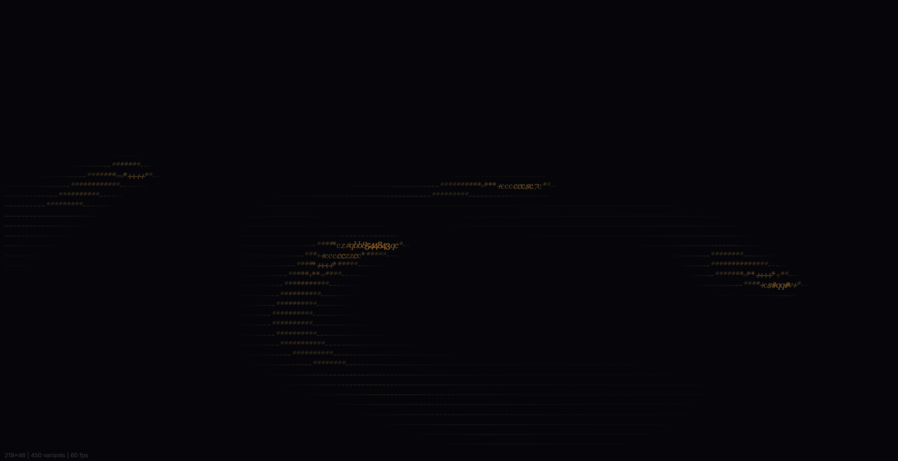
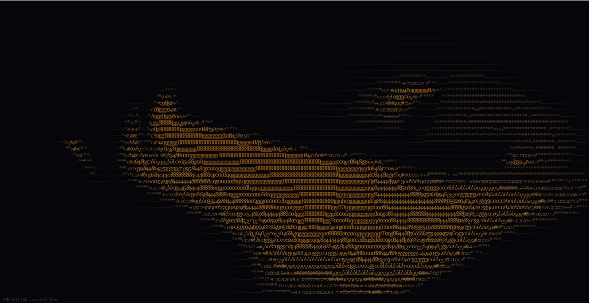

# Aether — Fluid Typography

> Smoke-like fluid dynamics drive real text layout on Canvas 2D.

[](https://aether-sage-beta.vercel.app/)
[](LICENSE)
[](https://www.typescriptlang.org/)
[](https://vitejs.dev/)

[Report a Bug](https://github.com/Poojan38380/aether/issues/new?template=bug_report.md) · [Request a Feature](https://github.com/Poojan38380/aether/issues/new?template=feature_request.md)

---

## ✨ Features

- **Fluid Simulation** — Multi-frequency trigonometric velocity field with semi-Lagrangian advection, diffusion, and emitter-based density injection
- **ASCII Smoke Rendering** — Smoke density mapped to a brightness-sorted character palette for organic, typographic vapor
- **Fluid-Aware Text Layout** — Body text flows dynamically around high-density smoke regions using real-time obstacle carving
- **Interactive** — Move your mouse to inject smoke; click to send shockwaves through the field
- **Touch Support** — Full touch event handling for mobile/tablet interaction
- **Zero Dependencies for Rendering** — Pure Canvas 2D, no WebGL, no external rendering libraries
- **Type-Safe** — Full TypeScript with strict mode

## 📸 Screenshots

| State | Preview |
|-------|---------|
| Normal |  |
| After Click (Shockwave) |  |

## 🛠 Tech Stack

| Category | Technology |
|----------|-----------|
| Language | [TypeScript 5.6+](https://www.typescriptlang.org/) |
| Build Tool | [Vite 6](https://vitejs.dev/) |
| Rendering | Canvas 2D API |
| Text Layout | [@chenglou/pretext](https://github.com/chenglou/pretext) |
| Fonts | Inter, Playfair Display, Georgia (Google Fonts) |

## 🚀 Getting Started

### Prerequisites

- [Node.js](https://nodejs.org/) 18+ and npm
- A modern browser with Canvas 2D support

### Installation

```bash
# Clone the repository
git clone https://github.com/Poojan38380/aether.git
cd aether

# Install dependencies
npm install
```

### Development

```bash
# Start the dev server (with hot reload)
npm run dev
```

Open `http://localhost:5173` in your browser.

### Production Build

```bash
# Type-check and build for production
npm run build

# Preview the production build locally
npm run preview
```

The output is written to `dist/`.

## 📐 Architecture

```
aether/
├── public/
│   ├── favicon.svg          # SVG favicon
│   ├── after-click.png      # Screenshot: shockwave state
│   └── home-page-normal-state.png  # Screenshot: default state
├── src/
│   ├── main.ts              # Entry point — canvas setup, input handling, render loop
│   ├── fluid.ts             # Fluid simulation (advection, diffusion, emission, shockwaves)
│   ├── obstacles.ts         # Obstacle carving — convert density → blocked intervals
│   └── palette.ts           # Character palette building — brightness measurement & matching
├── index.html               # HTML shell + loading screen styles
├── package.json
├── tsconfig.json
└── vite.config.ts
```

### How It Works

1. **Fluid Simulation** (`fluid.ts`) — A grid-based velocity field advects density using semi-Lagrangian tracing. Four orbiting emitters inject density. Mouse clicks create shockwave rings.
2. **Character Palette** (`palette.ts`) — At startup, every character in the charset is measured for width (via pretext) and brightness (via offscreen canvas pixel scan). Entries are sorted by brightness for fast lookup.
3. **Smoke Rendering** (`main.ts::drawSmokeAscii`) — Each frame, the density grid is sampled. For each cell, the best-matching character is selected by brightness and width, then drawn on the canvas.
4. **Text Layout** (`main.ts::drawTextAroundSmoke`) — Body text is laid out line-by-line using pretext. For each line row, high-density columns become blocked intervals. Available slots are carved, and text is placed in the widest slot.

## ⚡ Performance Targets

| Metric | Target |
|--------|--------|
| Grid Size | Up to 250 × 100 cells |
| Frame Rate | 60 FPS on modern desktop |
| Palette Size | ~200 entries (3 weights × 2 styles × ~35 chars) |
| Startup Time | < 2s (includes font loading + palette measurement) |
| Bundle Size | < 50 KB gzipped (excluding fonts) |

## 🗺 Roadmap

### ✅ Completed (v0.1.0)

- [x] Core fluid simulation (advection, diffusion, emission)
- [x] ASCII smoke rendering with brightness-matched palette
- [x] Fluid-aware text layout with obstacle carving
- [x] Mouse interaction (smoke injection + shockwaves)
- [x] Touch support
- [x] FPS counter + grid stats overlay
- [x] Responsive canvas with DPR scaling
- [x] Graceful resize handling (density preservation)

### 🔄 In Progress / Planned

- [ ] Draggable obstacles that text flows around
- [ ] Configurable text content and font families
- [ ] Color theme presets
- [ ] Performance scaling for mobile (adaptive grid)
- [ ] Export/share fluid states

## 🤝 Contributing

Contributions are welcome! Please read [CONTRIBUTING.md](CONTRIBUTING.md) for details on our code of conduct and the process for submitting pull requests.

## 📜 License

This project is licensed under the MIT License — see the [LICENSE](LICENSE) file for details.

## 🙏 Acknowledgments

- [@chenglou/pretext](https://github.com/chenglou/pretext) — Instant, DOM-free text measurement and layout
- [Google Fonts](https://fonts.google.com/) — Inter, Playfair Display, Georgia
- The creative coding and generative art community for inspiring fluid typography experiments

## 📬 Contact

- **Author:** Poojan Goyani
- **Buy Me a Coffee:** [☕ buymeacoffee.com/poojan38380](https://buymeacoffee.com/poojan38380)

---

⭐ **If you find this project interesting, consider giving it a star!** It helps others discover it and motivates further development.
